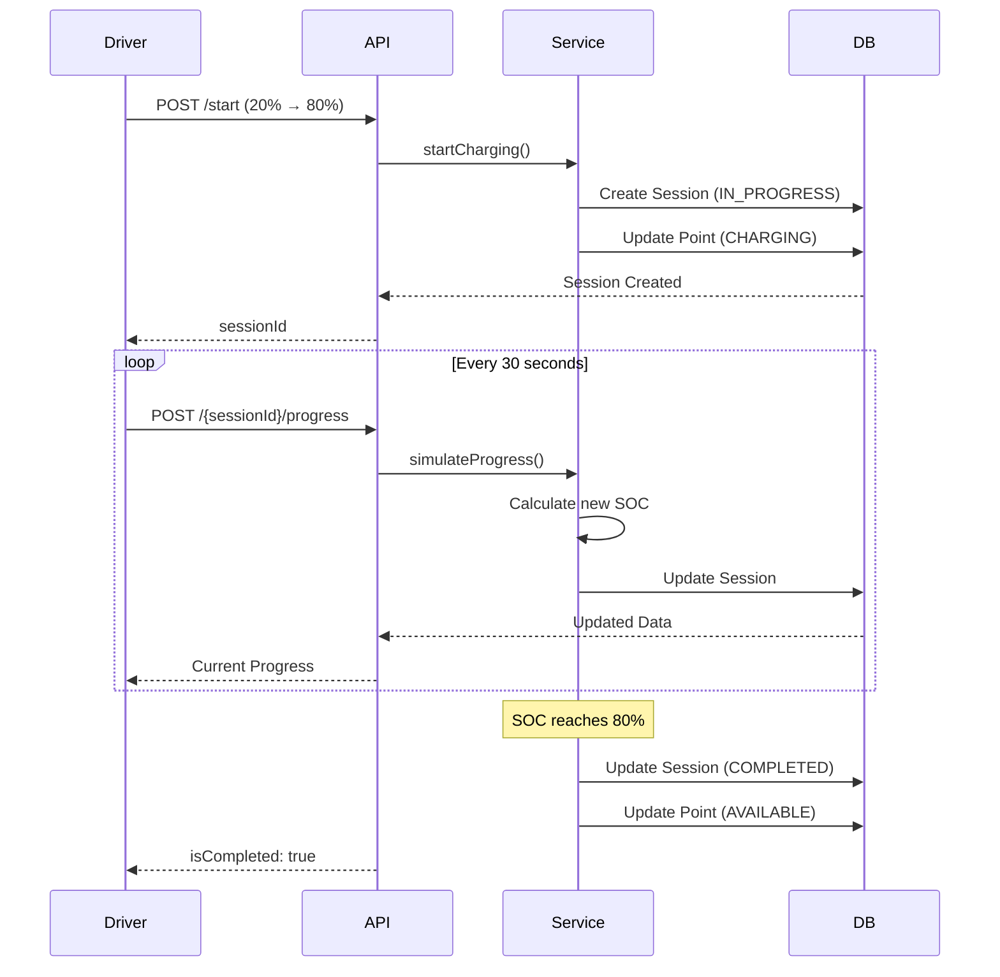
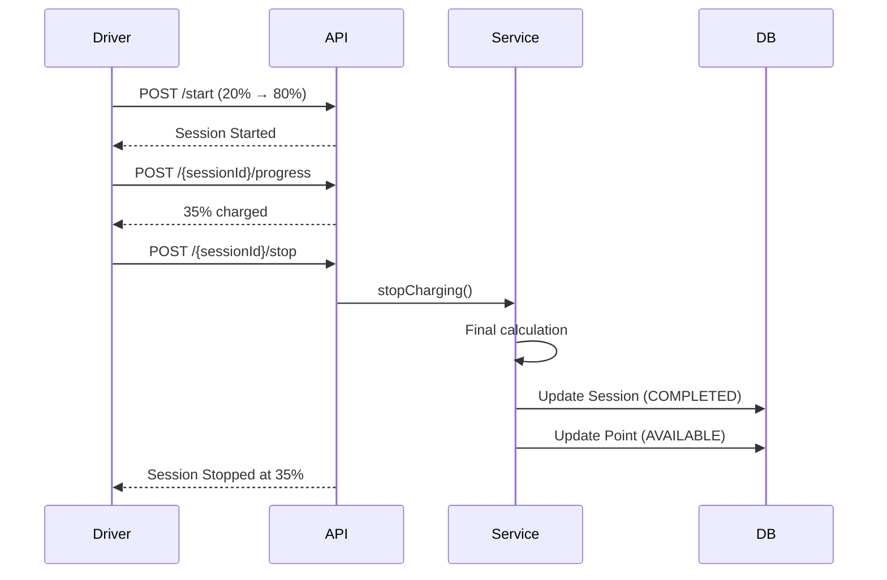

# Hướng Dẫn Sử Dụng Hệ Thống Giả Lập Sạc Điện

## Tổng Quan

Hệ thống giả lập quá trình sạc điện cho xe điện (EV) cho phép:
- Bắt đầu phiên sạc mới với thông số tùy chỉnh
- Theo dõi tiến trình sạc theo thời gian thực
- Giả lập quá trình tăng % pin dựa trên công suất trạm
- Tính toán chi phí, thời gian và năng lượng tiêu thụ
- Dừng phiên sạc bất kỳ lúc nào

## Kiến Trúc Hệ Thống

### 1. **Entities**
- `ChargingSession`: Lưu trữ thông tin phiên sạc
- `ChargingPoint`: Điểm sạc tại trạm
- `Vehicle`: Xe điện của driver
- `Driver`: Tài xế sử dụng dịch vụ

### 2. **DTOs**
- `StartChargingRequest`: Request để bắt đầu sạc
- `ChargingProgressResponse`: Thông tin tiến trình sạc chi tiết
- `ChargingSimulationResponse`: Kết quả giả lập từng bước

### 3. **Services**
- `ChargingSimulationService`: Logic giả lập và quản lý phiên sạc

### 4. **Controllers**
- `ChargingSimulationController`: API endpoints

## API Endpoints

### 1. Bắt Đầu Phiên Sạc

**Endpoint:** `POST /api/charging-simulation/start`

**Authorization:** Role `DRIVER` required

**Request Body:**
```json
{
  "vehicleId": "uuid-of-vehicle",
  "chargingPointId": "uuid-of-charging-point",
  "startSocPercent": 20,
  "targetSocPercent": 80
}
```

**Validation:**
- `vehicleId`: Bắt buộc, phải tồn tại và thuộc về driver
- `chargingPointId`: Bắt buộc, phải available
- `startSocPercent`: 0-100
- `targetSocPercent`: 1-100, phải lớn hơn startSocPercent

**Response:**
```json
{
  "code": 1000,
  "message": "Charging session started successfully",
  "result": {
    "sessionId": "generated-session-uuid",
    "vehicleId": "uuid-of-vehicle",
    "vehicleLicensePlate": "29A-12345",
    "vehicleModel": "Tesla Model 3",
    "chargingPointId": "uuid-of-charging-point",
    "stationName": "Trạm Sạc Quận 1",
    "maxPowerKw": 50.0,
    "startTime": "2025-10-20T10:00:00",
    "startSocPercent": 20,
    "currentSocPercent": 20,
    "targetSocPercent": 80,
    "energyDeliveredKwh": 0.0,
    "estimatedTotalEnergyKwh": 36.0,
    "progressPercent": 0,
    "elapsedTimeMinutes": 0,
    "estimatedRemainingMinutes": 43,
    "currentCost": 0.0,
    "estimatedTotalCost": 126000.0,
    "pricePerKwh": 3500.0,
    "status": "IN_PROGRESS",
    "statusMessage": "Đang sạc"
  }
}
```

**Example cURL:**
```bash
curl -X POST http://localhost:8080/api/charging-simulation/start \
  -H "Content-Type: application/json" \
  -H "Authorization: Bearer YOUR_JWT_TOKEN" \
  -d '{
    "vehicleId": "vehicle-uuid",
    "chargingPointId": "point-uuid",
    "startSocPercent": 20,
    "targetSocPercent": 80
  }'
```

---

### 2. Giả Lập Tiến Trình Sạc

**Endpoint:** `POST /api/charging-simulation/{sessionId}/progress`

**Authorization:** Role `DRIVER` required

**Description:** 
Endpoint này giả lập quá trình sạc, tăng % pin dựa trên:
- Thời gian đã trôi qua
- Công suất tối đa của charging point (kW)
- Dung lượng pin của xe (kWh)

**Formula:**
```
Energy Delivered (kWh) = Power (kW) × Time (hours)
SOC Increase (%) = (Energy Delivered / Battery Capacity) × 100
Current Cost (VNĐ) = Energy Delivered × Price Per kWh
```

**Path Parameter:**
- `sessionId`: UUID của phiên sạc

**Response:**
```json
{
  "code": 1000,
  "result": {
    "sessionId": "session-uuid",
    "message": "Charging in progress",
    "currentSocPercent": 35,
    "energyDeliveredKwh": 9.0,
    "currentCost": 31500.0,
    "isCompleted": false
  }
}
```

**Khi hoàn thành:**
```json
{
  "code": 1000,
  "result": {
    "sessionId": "session-uuid",
    "message": "Charging completed",
    "currentSocPercent": 80,
    "energyDeliveredKwh": 36.0,
    "currentCost": 126000.0,
    "isCompleted": true
  }
}
```

**Example cURL:**
```bash
curl -X POST http://localhost:8080/api/charging-simulation/{sessionId}/progress \
  -H "Authorization: Bearer YOUR_JWT_TOKEN"
```

**Use Case:**
Frontend có thể gọi endpoint này:
- Định kỳ mỗi 30 giây để cập nhật UI
- Khi user nhấn nút "Refresh"
- Hoặc backend có thể chạy scheduled job tự động

---

### 3. Lấy Thông Tin Tiến Trình

**Endpoint:** `GET /api/charging-simulation/{sessionId}`

**Authorization:** Role `DRIVER` required

**Description:** 
Lấy thông tin chi tiết về tiến trình sạc hiện tại mà không thay đổi trạng thái

**Path Parameter:**
- `sessionId`: UUID của phiên sạc

**Response:**
```json
{
  "code": 1000,
  "result": {
    "sessionId": "session-uuid",
    "vehicleId": "vehicle-uuid",
    "vehicleLicensePlate": "29A-12345",
    "vehicleModel": "Tesla Model 3",
    "chargingPointId": "point-uuid",
    "stationName": "Trạm Sạc Quận 1",
    "maxPowerKw": 50.0,
    "startTime": "2025-10-20T10:00:00",
    "startSocPercent": 20,
    "currentSocPercent": 45,
    "targetSocPercent": 80,
    "energyDeliveredKwh": 15.0,
    "estimatedTotalEnergyKwh": 36.0,
    "progressPercent": 42,
    "elapsedTimeMinutes": 18,
    "estimatedRemainingMinutes": 25,
    "currentCost": 52500.0,
    "estimatedTotalCost": 126000.0,
    "pricePerKwh": 3500.0,
    "status": "IN_PROGRESS",
    "statusMessage": "Đang sạc"
  }
}
```

**Example cURL:**
```bash
curl -X GET http://localhost:8080/api/charging-simulation/{sessionId} \
  -H "Authorization: Bearer YOUR_JWT_TOKEN"
```

---

### 4. Dừng Phiên Sạc

**Endpoint:** `POST /api/charging-simulation/{sessionId}/stop`

**Authorization:** Role `DRIVER` required

**Description:** 
Dừng phiên sạc trước khi đạt target SOC. Charging point sẽ được giải phóng về trạng thái AVAILABLE.

**Path Parameter:**
- `sessionId`: UUID của phiên sạc

**Response:**
```json
{
  "code": 1000,
  "message": "Charging session stopped successfully",
  "result": {
    "sessionId": "session-uuid",
    "vehicleId": "vehicle-uuid",
    "vehicleLicensePlate": "29A-12345",
    "vehicleModel": "Tesla Model 3",
    "chargingPointId": "point-uuid",
    "stationName": "Trạm Sạc Quận 1",
    "maxPowerKw": 50.0,
    "startTime": "2025-10-20T10:00:00",
    "startSocPercent": 20,
    "currentSocPercent": 65,
    "targetSocPercent": 65,
    "energyDeliveredKwh": 27.0,
    "estimatedTotalEnergyKwh": 27.0,
    "progressPercent": 100,
    "elapsedTimeMinutes": 32,
    "estimatedRemainingMinutes": 0,
    "currentCost": 94500.0,
    "estimatedTotalCost": 94500.0,
    "pricePerKwh": 3500.0,
    "status": "COMPLETED",
    "statusMessage": "Hoàn thành"
  }
}
```

**Example cURL:**
```bash
curl -X POST http://localhost:8080/api/charging-simulation/{sessionId}/stop \
  -H "Authorization: Bearer YOUR_JWT_TOKEN"
```

---

## Workflow Sử Dụng

### Kịch Bản 1: Sạc Đầy Đủ



### Kịch Bản 2: Dừng Giữa Chừng



---

## Cấu Hình

### Thông Số Mặc Định

```java
// Giá điện (VNĐ/kWh)
DEFAULT_PRICE_PER_KWH = 3500f;

// Formula tính năng lượng
Energy (kWh) = Power (kW) × Time (hours)

// Formula tính SOC
SOC Increase (%) = (Energy / Battery Capacity) × 100

// Formula tính chi phí
Cost (VNĐ) = Energy × Price Per kWh
```

### Ví Dụ Tính Toán

**Giả sử:**
- Battery Capacity: 60 kWh (Tesla Model 3)
- Charging Power: 50 kW (DC Fast Charging)
- Start SOC: 20%
- Target SOC: 80%
- Price: 3,500 VNĐ/kWh

**Tính toán:**
```
SOC to charge = 80% - 20% = 60%
Energy needed = 60 kWh × 60% = 36 kWh
Time needed = 36 kWh ÷ 50 kW = 0.72 hours = 43 minutes
Total cost = 36 kWh × 3,500 VNĐ = 126,000 VNĐ
```

---

## Xử Lý Lỗi

### Error Codes

| Code | Error | Description |
|------|-------|-------------|
| 5001 | VEHICLE_NOT_FOUND | Xe không tồn tại |
| 9002 | UNAUTHORIZED | Xe không thuộc về driver |
| 11001 | CHARGING_POINT_NOT_FOUND | Điểm sạc không tồn tại |
| 15001 | CHARGING_POINT_NOT_AVAILABLE | Điểm sạc đang bận |
| 15002 | INVALID_SOC_RANGE | Start SOC >= Target SOC |
| 15003 | CHARGING_SESSION_NOT_FOUND | Session không tồn tại |
| 15004 | CHARGING_SESSION_NOT_ACTIVE | Session không ở trạng thái IN_PROGRESS |

### Ví Dụ Error Response

```json
{
  "code": 15001,
  "message": "Charging Point Not Available"
}
```

---

## Testing với Postman

### 1. Setup Environment

Tạo environment với variables:
```
base_url: http://localhost:8080
token: YOUR_JWT_TOKEN
sessionId: (sẽ được set tự động)
```

### 2. Test Flow

**Step 1: Login để lấy token**
```http
POST {{base_url}}/api/auth/login
Content-Type: application/json

{
  "username": "driver1",
  "password": "password123"
}
```

**Step 2: Start Charging**
```http
POST {{base_url}}/api/charging-simulation/start
Authorization: Bearer {{token}}
Content-Type: application/json

{
  "vehicleId": "your-vehicle-uuid",
  "chargingPointId": "your-point-uuid",
  "startSocPercent": 20,
  "targetSocPercent": 80
}
```

Lưu `sessionId` từ response vào environment variable.

**Step 3: Simulate Progress (gọi nhiều lần)**
```http
POST {{base_url}}/api/charging-simulation/{{sessionId}}/progress
Authorization: Bearer {{token}}
```

Đợi 1-2 phút giữa các lần gọi để thấy sự thay đổi.

**Step 4: Get Progress**
```http
GET {{base_url}}/api/charging-simulation/{{sessionId}}
Authorization: Bearer {{token}}
```

**Step 5 (Optional): Stop Charging**
```http
POST {{base_url}}/api/charging-simulation/{{sessionId}}/stop
Authorization: Bearer {{token}}
```

---

## Frontend Integration

### React Example

```javascript
import { useState, useEffect } from 'react';
import axios from 'axios';

const ChargingSimulation = () => {
  const [sessionId, setSessionId] = useState(null);
  const [progress, setProgress] = useState(null);
  const [isCharging, setIsCharging] = useState(false);

  // Start charging
  const startCharging = async (vehicleId, pointId, startSOC, targetSOC) => {
    try {
      const response = await axios.post('/api/charging-simulation/start', {
        vehicleId,
        chargingPointId: pointId,
        startSocPercent: startSOC,
        targetSocPercent: targetSOC
      }, {
        headers: { Authorization: `Bearer ${token}` }
      });
      
      setSessionId(response.data.result.sessionId);
      setProgress(response.data.result);
      setIsCharging(true);
    } catch (error) {
      console.error('Error starting charging:', error);
    }
  };

  // Update progress every 30 seconds
  useEffect(() => {
    if (!isCharging || !sessionId) return;

    const interval = setInterval(async () => {
      try {
        const response = await axios.post(
          `/api/charging-simulation/${sessionId}/progress`,
          {},
          { headers: { Authorization: `Bearer ${token}` } }
        );
        
        const result = response.data.result;
        
        // Update UI
        setProgress(prev => ({
          ...prev,
          currentSocPercent: result.currentSocPercent,
          energyDeliveredKwh: result.energyDeliveredKwh,
          currentCost: result.currentCost
        }));

        // Stop polling if completed
        if (result.isCompleted) {
          setIsCharging(false);
          clearInterval(interval);
        }
      } catch (error) {
        console.error('Error updating progress:', error);
      }
    }, 30000); // 30 seconds

    return () => clearInterval(interval);
  }, [isCharging, sessionId]);

  // Stop charging
  const stopCharging = async () => {
    try {
      await axios.post(
        `/api/charging-simulation/${sessionId}/stop`,
        {},
        { headers: { Authorization: `Bearer ${token}` } }
      );
      
      setIsCharging(false);
    } catch (error) {
      console.error('Error stopping charging:', error);
    }
  };

  return (
    <div>
      {/* UI components here */}
      <div className="battery-indicator">
        <div style={{ width: `${progress?.currentSocPercent}%` }} />
      </div>
      
      <div className="progress-info">
        <p>Current SOC: {progress?.currentSocPercent}%</p>
        <p>Energy: {progress?.energyDeliveredKwh} kWh</p>
        <p>Cost: {progress?.currentCost} VNĐ</p>
        <p>Time: {progress?.elapsedTimeMinutes} minutes</p>
      </div>
      
      <button onClick={stopCharging} disabled={!isCharging}>
        Stop Charging
      </button>
    </div>
  );
};
```

---

## Advanced Features (Future)

### 1. WebSocket Real-time Updates
Thay vì polling, sử dụng WebSocket để push updates:
```java
@MessageMapping("/charging/progress")
@SendTo("/topic/charging/{sessionId}")
public ChargingProgressResponse sendProgress(String sessionId) {
    return chargingSimulationService.getChargingProgress(sessionId);
}
```

### 2. Scheduled Background Jobs
Tự động cập nhật progress mà không cần frontend gọi:
```java
@Scheduled(fixedRate = 30000) // Every 30 seconds
public void updateActiveChargingSessions() {
    activeSimulations.keySet().forEach(sessionId -> {
        simulateChargingProgress(sessionId);
    });
}
```

### 3. Dynamic Pricing
Giá điện thay đổi theo giờ cao điểm:
```java
private float getPricePerKwh(LocalDateTime time) {
    int hour = time.getHour();
    if (hour >= 22 || hour < 6) return 2500f; // Off-peak
    if (hour >= 18 && hour < 22) return 4500f; // Peak
    return 3500f; // Normal
}
```

### 4. Battery Health Simulation
Giả lập sức khỏe pin giảm theo thời gian:
```java
float batteryHealth = 100f - (totalCycles * 0.01f);
float effectiveCapacity = batteryCapacityKwh * (batteryHealth / 100f);
```

---

## Troubleshooting

### Q: Session không tìm thấy sau khi completed?
**A:** Session đã hoàn thành sẽ bị xóa khỏi `activeSimulations` map. Dùng endpoint GET để lấy thông tin từ database.

### Q: Progress không tăng?
**A:** Kiểm tra:
- Thời gian giữa các lần gọi (cần ít nhất 1 phút để thấy sự thay đổi rõ)
- Công suất charging point (kW)
- Dung lượng pin xe (kWh)

### Q: Chi phí sai?
**A:** Công thức: `Cost = Energy × Price`. Kiểm tra `DEFAULT_PRICE_PER_KWH` trong service.

### Q: Charging point không về AVAILABLE?
**A:** Đảm bảo gọi endpoint `/stop` hoặc để session tự hoàn thành khi đạt target SOC.

---

## Database Schema

### charging_sessions Table
```sql
CREATE TABLE charging_sessions (
    session_id VARCHAR(36) PRIMARY KEY,
    driver_id VARCHAR(36),
    vehicle_id VARCHAR(36),
    point_id VARCHAR(36),
    start_time TIMESTAMP,
    end_time TIMESTAMP,
    start_soc_percent INT,
    end_soc_percent INT,
    energy_kwh FLOAT,
    duration_min INT,
    cost_total FLOAT,
    started_by_user_id VARCHAR(36),
    status VARCHAR(20),
    FOREIGN KEY (driver_id) REFERENCES drivers(user_id),
    FOREIGN KEY (vehicle_id) REFERENCES vehicles(vehicle_id),
    FOREIGN KEY (point_id) REFERENCES charging_points(point_id)
);
```

---

## Best Practices

1. **Always validate vehicle ownership** trước khi start charging
2. **Check charging point availability** để tránh conflict
3. **Handle concurrent requests** với transaction management
4. **Log all charging events** cho audit trail
5. **Implement rate limiting** để tránh spam API
6. **Cache charging progress** để giảm database load
7. **Use Redis** cho production thay vì in-memory map

---

## Support

Nếu có vấn đề, liên hệ:
- Email: support@evcharging.com
- Slack: #ev-charging-dev
- GitHub Issues: [Link to repository]

---

**Version:** 1.0.0  
**Last Updated:** October 20, 2025  
**Author:** EV Charging Station Development Team

